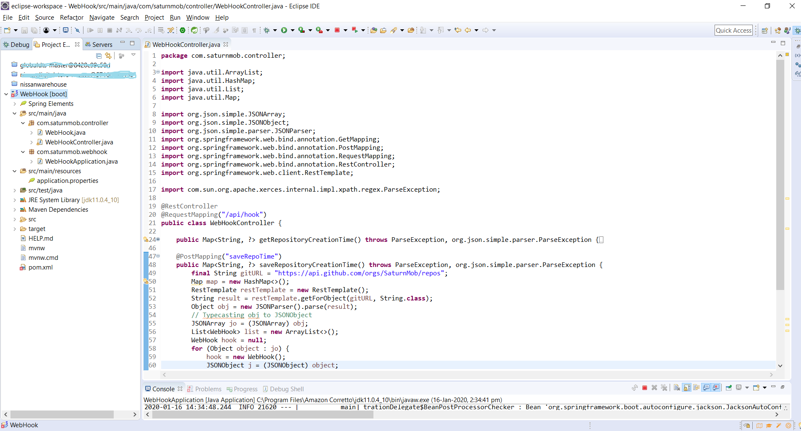

## Simple Webhook Service
---

This is a simple web service that listens for Github [organization events](https://developer.github.com/webhooks/#events) to know when a repository has been created.

Before you begin, you should familiarize yourself with GitHub [help documentation](https://help.github.com/en) and [powerful API](https://developer.github.com/v3/) that enables developers to easily access GitHub data.

__Step1:__
Download and install below mentioned  S/W tools in your working machine. 

1. Java SE Development Kit 8 or later version, I have used [Amazon Corretto Open JDK 11](https://aws.amazon.com/corretto/)
2. [Eclipse IDE](https://www.eclipse.org/downloads/) with Spring framework plugin. You can also install [Spring Tool](https://spring.io/tools) in alternate.
3. [Postman](https://www.getpostman.com/downloads/)
4. [ngrok](https://ngrok.com/download)

__Note:__ this application built and run into __Windows OS__. Same code can be deployed in other OS platforms as well.

__Step2:__
Create a Github account: [https://github.com/join](https://github.com/join)


__Step3:__
Create a new [organization](https://help.github.com/en/github/setting-up-and-managing-organizations-and-teams/creating-a-new-organization-from-scratch) from scratch. You can create one for [free](https://github.com/organizations/plan). Created oragnization would look like


__Step4:__
Create a new [internal repository](https://help.github.com/en/github/creating-cloning-and-archiving-repositories/creating-an-internal-repository#about-internal-repositories) (in order to get a branch, you need a commit! Make sure to initialize with a README)


__Step5:__
Web service that listens for [webhook](https://developer.github.com/webhooks/) deliveries. In order to build the web service, 
- first install and set the system/configuration path of __Step1__ tools in your development machine. 
- Download and extract the [source code](https://github.com/SaturnMob/Part2-Challenge/blob/master/WebHook-GithubCode.zip), available in this [repository](https://github.com/SaturnMob/Part2-Challenge).



This is the sample web service code:

	@RestController
	@RequestMapping("/api/hook")
	public class WebHookController{
	@GetMapping("getRepoTime")
	public Map<String, ?> getRepositoryCreationTime() throws ParseException, org.json.simple.parser.ParseException {
		final String gitURL = "https://api.github.com/orgs/SaturnMob/repos";
		Map map = new HashMap<>();
		RestTemplate restTemplate = new RestTemplate();
		String result = restTemplate.getForObject(gitURL, String.class);
		Object obj = new JSONParser().parse(result);
		// Typecasting obj to JSONObject
		JSONArray jo = (JSONArray) obj;
		List<WebHook> list = new ArrayList<>();
		WebHook hook = null;
		for (Object object : jo) {
			hook = new WebHook();
			JSONObject j = (JSONObject) object;
			hook.setRepoName(j.get("name").toString());
			hook.setRepoCreationTime(j.get("created_at").toString());
			list.add(hook);
		}
		map.put("Total Repo", list.size() + "");
		map.put("hook", list);
		return map;
	}
	
	@PostMapping("saveRepoTime")
	public Map<String, ?> saveRepositoryCreationTime() throws ParseException, org.json.simple.parser.ParseException {
		final String gitURL = "https://api.github.com/orgs/SaturnMob/repos";
		Map map = new HashMap<>();
		RestTemplate restTemplate = new RestTemplate();
		String result = restTemplate.getForObject(gitURL, String.class);
		Object obj = new JSONParser().parse(result);
		// Typecasting obj to JSONObject
		JSONArray jo = (JSONArray) obj;
		List<WebHook> list = new ArrayList<>();
		WebHook hook = null;
		for (Object object : jo) {
			hook = new WebHook();
			JSONObject j = (JSONObject) object;
			hook.setRepoName(j.get("name").toString());
			hook.setRepoCreationTime(j.get("created_at").toString());
			list.add(hook);
		}
		map.put("Total Repo", list.size() + "");
		map.put("hook", list);
		return map;

	}

}

- Go to Eclipse IDE -> Click on 'File' menu -> select 'Import' option -> choose 'Existing Maven Project' under select an import wizard text-field. In 'Root Directory', pick the extracted project folder from saved path and 'checked' the /pom.xml checkbox before proceeding to next step in progress. Done.
- After successful If it shows error, you might need to update the project or dependencies. Right-click on the project -> go to 'Maven' -> click on 'Update Project' or press [Alt+F5] in alternate. [Please be noted, sometime pom.xml file throwing an unknown error though there's no issue in application. This is the latest surprise [Eclipse bug](https://bugs.eclipse.org/bugs/show_bug.cgi?id=547340) when using Spring Boot 2.1.5 due to Spring Boot 2.1.5 upgrade `maven-jar-plugin` to 3.1.2
The workaround is to downgrade it to the previous version by adding the following to `pom.xml` :
```
<properties>
<maven-jar-plugin.version>3.1.1</maven-jar-plugin.version>
</properties>
```
- Run the application. Right click on main class i.e., 'WebHookApplication' -> Run as 'Java Application'. That's it.
- Open the web browser and type below url to know about when new repository has been created in your created organization,
'[http://localhost:8090/saturnmob/api/hook/getRepoTime](http://localhost:8090/saturnmob/api/hook/getRepoTime)' - GET,  'http://localhost:8090/saturnmob/api/hook/saveRepoTime' - POST

You can also check and validate the above url response in [Postman](https://www.getpostman.com/downloads/) tool. 

__Step6:__ 
- Configure your server using 'ngrok': [https://developer.github.com/webhooks/configuring/#using-ngrok](https://developer.github.com/webhooks/configuring/#using-ngrok), with that, you can expose your localhost by running `./ngrok http 4567` on the command line. You should see a line that looks something like this: `http://4be3bfe0.ngrok.io/saturnmob/api/hook/saveRepoTime`,

 
 
 by doing this, we've set ourselves up to expose our localhost at path `/payload` to the Internet.
- Creating and Setting-up a Webhook: [https://developer.github.com/webhooks/creating/](https://developer.github.com/webhooks/creating/)


- Now that you've configured your local server, you might be interested in pushing your code to the limits. To that end, GitHub's webhooks view provides some tooling for testing your deployed payloads. Please be noted, GitHub keeps a log of each webhook delivery for 30 days.

- Digging into the result: by expanding an individual delivery, you'll be able to witness _precisely_ what information GitHub is attempting to send to your server. This includes both the HTTP Request and Response. The expected response would look like:

 

---		


__Resources:__

 1. Github Help: [https://help.github.com/en](https://help.github.com/en)
 2. Github Services APIs: [https://api.github.com/](https://api.github.com/)
 3. Github Developer API: [https://developer.github.com/v3/](https://developer.github.com/v3/)
 4. Blog: [https://codeburst.io/whats-a-webhook-1827b07a3ffa](https://codeburst.io/whats-a-webhook-1827b07a3ffa)
 5. Webhooks: [https://developer.github.com/webhooks/](https://developer.github.com/webhooks/)
 6. Spring Initializr: [https://start.spring.io/](https://start.spring.io/)
 7. Sample: [https://github.com/Esri/webhooks-samples](https://github.com/Esri/webhooks-samples)
 


